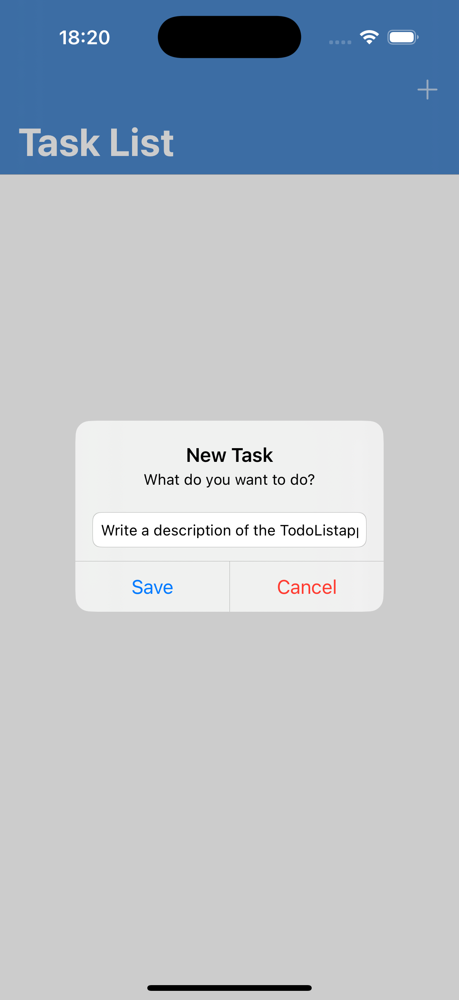
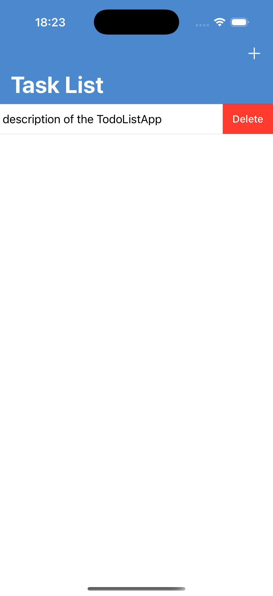

# TodoListApp

Простое iOS-приложение «Список дел». Вёрстка кодом, без Storyboard. Точка входа через `SceneDelegate`.

## Стек
- Swift 5.10+
- iOS 15.0+
- UIKit, Auto Layout, програмная вёрстка
- Навигация: `UINavigationController`
- Хранение: CoreData

## Возможности
- Создание задачи
- Отметка выполнения
- Удаление задачи
- Редактирование

| Создание | Удаление | 
|---|---|
|  |  |
