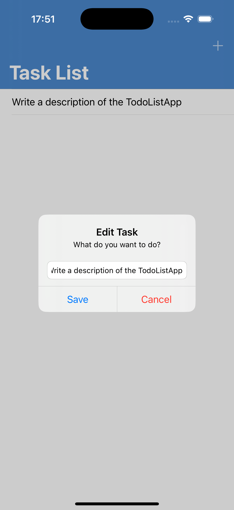

# TodoListApp

Небольшое iOS-приложение «Список дел». Вёрстка кодом, без Storyboard. Точка входа через `SceneDelegate`.

## Стек
- Swift 5.10+
- iOS 15.0+
- UIKit, Auto Layout, програмная вёрстка
- Навигация: `UINavigationController`
- Хранение: CoreData

## Возможности
- Создание задачи
- Отметка выполнения
- Удаление задачи
- Редактирование

## Архитектура
- Паттерн: **MVC** (Controller управляет экраном, модель — данные задачи)
- Слои: `UI` → `Presentation` → `Storage`
- Зависимости через инициализаторы, без singletons в логике

| Создание | Удаление | Редактирование |
|---|---|---|
|  |  |  |

## Тесты
- XCTest
